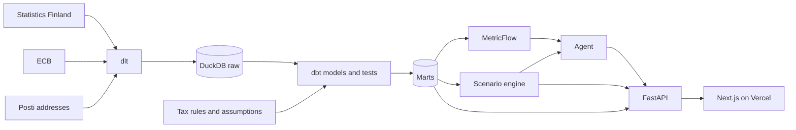

# asumisvalinta

Rent, right of occupancy (asumisoikeus) or buy a flat in Finland? Asumisvalinta compares the three over the years you plan to stay, using official open data for every area of the country and the numbers of the flats you are looking at. The site is in Finnish, with an English version at `/en`.

- **Explore** a map of all 3,018 postal code areas, coloured by price, rent or price-to-rent ratio.
- **Compare** the three options for one flat. Each input starts at the market value for the area, size and building age, and shows how your own figure differs from the market.
- **Search by address.** Type a street and building number, such as "Mannerheimintie 40", to find its postal code area. Accents and small typos are tolerated, and a municipality name narrows a street name that exists in several towns.
- **Ask** questions about the housing market in plain language. An assistant answers only with governed metrics and says which data it used.

## Stack

| Layer | Tools | What it does |
|---|---|---|
| Ingestion | dlt, Python | Loads Statistics Finland (PxWeb API), the ECB (SDMX API), Paavo postal areas and Posti's street address file into DuckDB. Tables reload only when the source publishes an update, and ECB series load incrementally. |
| Warehouse | DuckDB, Snowflake | DuckDB for development, CI and serving. The same dbt project also runs on Snowflake as a second target. |
| Transformation | dbt | 42 staging, intermediate and mart models with 125 data tests, seeds for tax rules and assumptions, and a snapshot that keeps revised figures. SQL stays portable through dbt cross-database macros. |
| Semantic layer | MetricFlow | 22 governed metrics, such as price per m², rent per m², price change and interest rates, queried with dimensions and filters instead of raw SQL. At runtime MetricFlow reads the compiled semantic manifest through a read-only DuckDB client, without dbt. |
| Scenario engine | Python, Pydantic | Month-by-month cash flows, loans, Finnish capital income tax rules and break-even. All arithmetic is deterministic and tested against hand calculations. |
| Agent | OpenAI-compatible API | Answers questions through tools that query governed metrics, rank areas, look up the latest prices and rents of a postal code and run the scenario engine. Every number in an answer must come from a tool result. |
| Evaluation | pytest, YAML golden set | 58 questions with reference answers computed from the warehouse. The governed agent is scored against a text-to-SQL baseline. |
| API | FastAPI, Postgres (Neon) | Serves market data, scenario runs and the agent from a read-only copy of the warehouse. Reads are cached at the CDN. Postgres holds the agent's daily token cap and per-client request limits, shared by all instances. |
| Front end | Next.js, React, TypeScript, Tailwind CSS, MapLibre GL, ECharts, Radix UI | Map, comparison and question pages. The postal code map is simplified with mapshaper and shipped as TopoJSON. |
| Quality | pytest, ruff, SQLFluff, ESLint | Unit and integration tests against a fixture warehouse, Python and SQL linting, and type-checked TypeScript. |
| Delivery | GitHub Actions, Vercel | CI on every push, a monthly data refresh that publishes a GitHub release, a manually triggered evaluation run, and deployment of the web app and API as one Vercel project. |



## Design decisions

- **Official data first, with the level shown.** When a postal code has no published figure, the value comes from the nearest larger area that has one, and the app marks it.
- **Assumptions are visible and editable.** Tax rules and default assumptions live in dbt seeds with a source URL and a retrieval date.
- **The model computes, the language model does not.** The agent reaches data only through the semantic layer and the scenario engine, and an answer is rejected when its number is not in a tool result.
- **Right of occupancy follows the law, not listings.** The default fee is 15% of the buy price, the most the Act on right-of-occupancy dwellings allows in state-subsidised buildings, and the default monthly charge is 85% of the market rent, below comparable rents as the Act requires. Both are editable.
- **A locked-down public API.** Queries reach the warehouse on a read-only connection with file and network access disabled, filter names are validated before they reach the query, and each client waits a few seconds between questions within a daily token budget.
- **One data release a month.** The monthly workflow restores the previous warehouse, loads new data, runs dbt and the evaluation checks, and publishes the warehouse, dbt documentation and map as a GitHub release that the website builds from.

## Evaluation

The golden set in `evals/golden_set.yaml` holds 58 questions on prices, rents, interest rates and scenarios, each with a reference computation. In the latest full run the governed agent answered 84.5 % correctly against 72.4 % for the text-to-SQL baseline; for metric questions alone the scores were 85 % and 62.5 %.

## Run it locally

Requirements: Python 3.12 with [uv](https://docs.astral.sh/uv/), and Node.js 24.

```bash
uv sync --all-groups
cp .env.example .env            # add an API key only if you use the agent

uv run asumisvalinta-ingest     # load all sources into data/asumisvalinta.duckdb
uv run dbt build --project-dir dbt --profiles-dir dbt

uv run uvicorn asumisvalinta.api.app:app --port 8000
cd web && npm install && npm run build:map
API_ORIGIN=http://127.0.0.1:8000 npm run dev
```

Tests run against a small fixture warehouse built from `fixtures/`:

```bash
export ASUMISVALINTA_DUCKDB_PATH=data/fixture/asumisvalinta.duckdb
uv run python scripts/load_fixture.py
uv run dbt build --project-dir dbt --profiles-dir dbt --vars '{min_postal_codes_per_quarter: 1}'
uv run pytest
uv run asumisvalinta-eval --agent semantic --limit 10   # needs an API key
```

## Repository layout

```
src/asumisvalinta/   ingestion, semantic layer client, scenario engine, agent, evaluation, API
dbt/                 models, seeds, snapshot, tests and the semantic layer definitions
web/                 Next.js front end
evals/               golden question set
fixtures/            raw data slice for CI
content/             methodology shown in the app
```

## Data and licence

Source: Statistics Finland (licence CC BY 4.0), including Paavo postal code areas. Source: ECB statistics. Tax and lending rules from the Finnish Tax Administration, the Ministry of Finance, the State Treasury, Finlex and the Financial Supervisory Authority. Street addresses from the Posti Basic Address File, used under Posti's [terms of use](https://www.posti.fi/mzj3zpe8qb7p/1eKbwM2WAEY5AuGi5TrSZ7/c76a865cf5feb2c527a114b8615e9580/posti-postal-code-services-service-description-and-terms-of-use-20150101.pdf); the app shows the download date. Map tiles by OpenFreeMap, data from OpenStreetMap.

The code is licensed under the PolyForm Noncommercial License 1.0.0. See [LICENSE](LICENSE).
